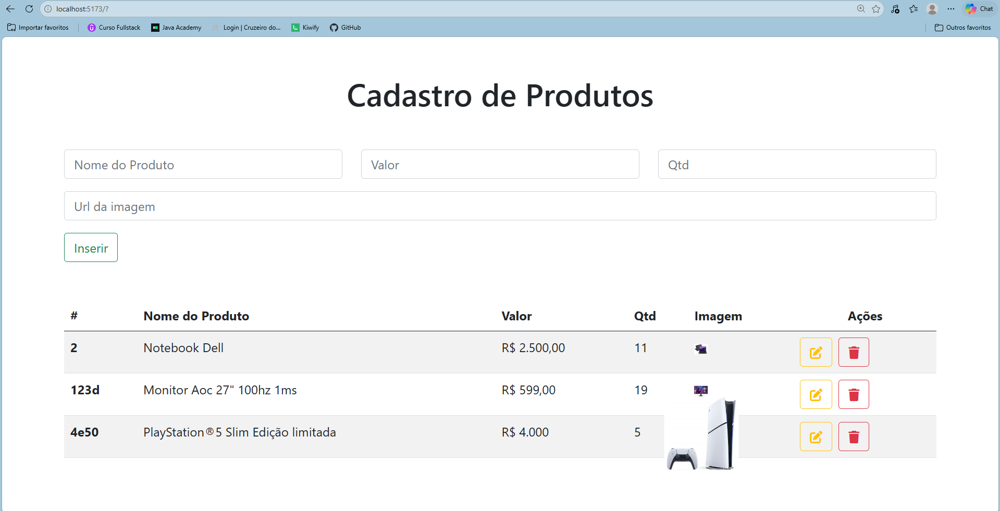

### Primeira tela

* React
    useState()
    useEffect()
* Font Awesome
    Icons
* Bootstrap
    Classes já vem configuradas
* Axios
    Get, Post, Put, Delete

#### Para rodar o projeto
´´´
npm run dev
´´´

#### Para rodar api
´´´
npm run api
´´´

#### Comandos Git 

*git init

*git add .

#### Comandos Usados  para atualizar um projeto

*git add .
*git commit -m updated
*git push